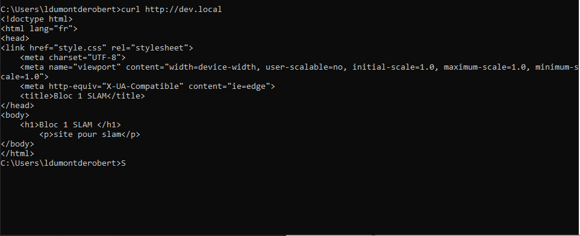
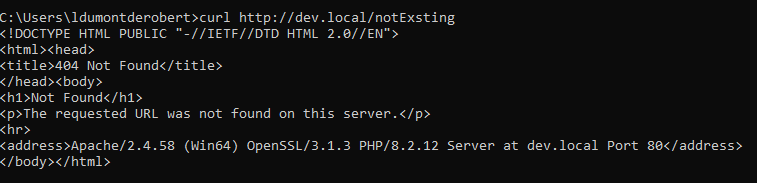

<h1> 1- Methode Get et Post : </h1>
<h2>GET :</h2/>

La méthode GET est utilisée par le navigateur pour demander au serveur de renvoyer une certaine ressource. La méthode GET passe les réponses saisies via l'URL.

 exemple : 
 GET /?say=Hi&to=Mom HTTP/1.1 

<h2>POST</h2>

La méthode POST est un peu différente.C'est la méthode que le navigateur utilise pour demander au serveur une réponse prenant en compte les données contenues dans le corps de la requête HTTP.  la méthode POST passe les paramètres dans le corps de la requête.

exemple : POST / HTTP/1.1

<h1> 2- Tableau comparatif : </h1>
<table>
  <thead>
    <tr>
      <th scope="col"></th>
      <th scope="col">Get</th>
      <th scope="col">Post</th>
    </tr>
  </thead>
  <tbody>
    <tr>
      <th scope="row">Visibilité</th>
      <td>Visible pour l’utilisateur dans le champ d’adresse	</td>
      <td>Invisible pour l’utilisateur
</td>
    </tr>
    <tr>
      <th scope="row">Marque-page et historique de navigation</th>
      <td>Les paramètres de l’URL sont stockés en même temps que l’URL.</td>
      <td>L’URL est enregistrée sans paramètres URL.</td>
    </tr>
    <tr>
      <th scope="row">Cache et fichier log du serveur</th>
      <td>Les paramètres de l’URL sont stockés sans chiffrement</td>
      <td>Les paramètres de l’URL ne sont pas enregistrés automatiquement.</td>
    </tr>
    <tr>
      <th scope="row">Comportement lors de l’actualisation du navigateur / Bouton « précédent »</th>
      <td>Les paramètres de l’URL ne sont pas envoyés à nouveau.</td>
      <td>Le navigateur avertit que les données du formulaire doivent être renvoyées.</td>
    </tr>
  </tbody>
  <tfoot>
    <tr>  
  </tfoot>
</table>

<h1>3- Extensible</h1>

À partir de HTTP/1.0, les en-têtes HTTP permettent d'étendre facilement le protocole et de mener des expérimentations avec celui-ci. De nouvelles fonctionnalités peuvent même être introduites par un simple accord entre le client et le serveur à propos de la sémantique des nouveaux en-têtes.

<h1>4- Sans états</h1>

HTTP est sans état : il n'y a pas de lien entre deux requêtes qui sont effectuées successivement sur la même connexion. Cela devient très rapidement problématique lorsque les utilisateurs veulent interagir avec une page de façon cohérente, par exemple avec un panier d'achat sur un site de commerce en ligne.

<h1>5- Décomposition d'un URL </h1>

 La structure de l'URL se compose du protocole, du nom de domaine, le chemin ainsi que les paramètres et l'ancre.

<h1>6- Code status</h1>

- Les réponses informatives (100-199)

- Les réponses de succès (200-299)

- Les messages de redirection (300-399)

- Les erreurs de client(400-499)

- Les erreurs de seveurs(500-599)

<h1>7- Négociation de contenu</h1>

Lorsqu'un client souhaite obtenir une ressource, il la demande via une URL. Le serveur utilise alors cette URL pour choisir l'une des variantes disponibles. Chaque variante est appelée une représentation. Le serveur renvoie alors une représentation donnée au client. La ressource, ainsi que chacune de ses représentations, dispose d'une URL spécifique. La négociation de contenu détermine quelle représentation donnée est utilisée lorsque la ressource est demandée.

 les informations proviennent de : https://developer.mozilla.org/fr/docs/Learn/Forms/Sending_and_retrieving_form_data 

 ou encore : https://www.ionos.fr/digitalguide/sites-internet/developpement-web/get-vs-post/

<h1>9- Curl</h1>

la commande "curl http://dev.local" permet d'afficher le code html de la page correspondante.

la commande "curl http://dev.local/notExisting" montre qe l'url n'a pas été touvé sur le serveur.

<h1>10- Headers</h1>
=======

En utilisant la commande "curl http://dev.local/notExisting" on peut voir que l'url n'a pas été touvé sur le serveur.

<h1>10- Headers</h1>

<table>
  <tr>
    <td>Nom</td>
    <td>En-têtes de requêtes</td>
    <td>En-têtes de réponse</td>
    <td>En-têtes de représentation</td>
    <td>En-têtes de charge utile</td>
  </tr>
  <tr>
    <td>Explication</td>
    <td>Contiennent des informations additionnelles à propos de la ressource à récupérer ou à propos du client qui la demande.</td>
    <td>Contiennent des informations supplémentaires au sujet de la réponse (par exemple son emplacement), ou au sujet du serveur qui la fournit.</td>
    <td>Contiennent des informations à propos du corps de la ressource, comme son type MIME, ou le type de compression ou d'encodage appliqué.

</td>
    <td>Contiennent des informations indépendantes de la représentation sur la charge utile, comme la longueur du contenu ou l'encodage utilisé pour le transport.

</td>
  </tr>
  <tr>
    <td>Exemple</td>
    <td>GET /home.html HTTP/1.1
Host: developer.mozilla.org
User-Agent: Mozilla/5.0 (Macintosh; Intel Mac OS X 10.9; rv:50.0) Gecko/20100101 Firefox/50.0
Accept: text/html,application/xhtml+xml,application/xml;q=0.9,*/*;q=0.8
Accept-Language: en-US,en;q=0.5
Accept-Encoding: gzip, deflate, br
Referer: https://developer.mozilla.org/testpage.html
Connection: keep-alive
Upgrade-Insecure-Requests: 1
If-Modified-Since: Mon, 18 Jul 2016 02:36:04 GMT
If-None-Match: "c561c68d0ba92bbeb8b0fff2a9199f722e3a621a"
Cache-Control: max-age=0</td>
    <td>200 OK
Access-Control-Allow-Origin: *
Connection: Keep-Alive
Content-Encoding: gzip
Content-Type: text/html; charset=utf-8
Date: Mon, 18 Jul 2016 16:06:00 GMT
Etag: "c561c68d0ba92bbeb8b0f612a9199f722e3a621a"
Keep-Alive: timeout=5, max=997
Last-Modified: Mon, 18 Jul 2016 02:36:04 GMT
Server: Apache
Set-Cookie: mykey=myvalue; expires=Mon, 17-Jul-2017 16:06:00 GMT; Max-Age=31449600; Path=/; secure
Transfer-Encoding: chunked
Vary: Cookie, Accept-Encoding
X-Backend-Server: developer2.webapp.scl3.mozilla.com
X-Cache-Info: not cacheable; meta data too large
X-kuma-revision: 1085259
x-frame-options: DENY</td>
    <td>                </td>
    <td>                </td>
  </tr>
  <tr>
   
</table>

https://developer.mozilla.org/fr/docs/Web/HTTP/Overview
